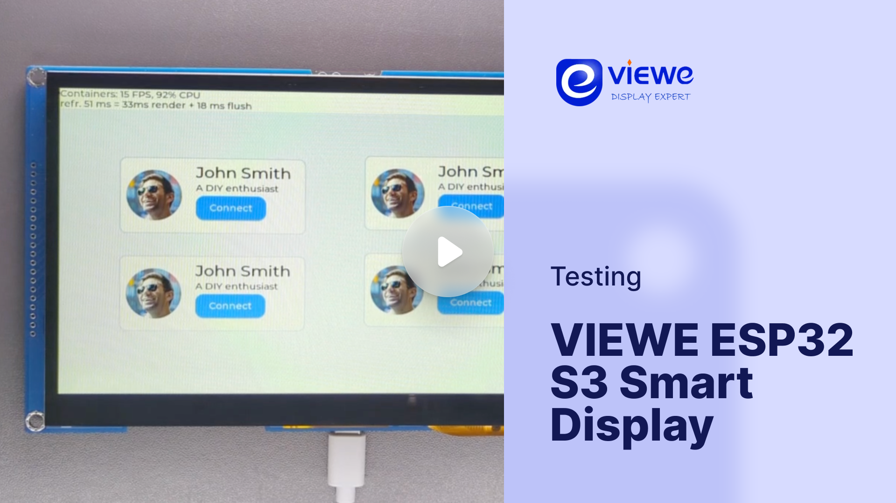

# LVGL ported to VIEWE 7.0"

## Overview

The Viewe ESP32 S3 Smart Display, designed and developed by Viewe Display, features an 800×480 resolution with 300 cd/m² brightness and multi-point capacitive touch. Powered by an ESP32-S3 (240MHz) with 8MB RAM and 16MB Flash, it supports Wi-Fi, BLE 5, and BLE Mesh. Designed for Arduino, ESP-IDF, and LVGL platforms, it offers UART and USB interfaces for versatile IoT and AIoT applications.

## Buy

You can purchase Viewe ESP32 S3 Smart Display from https://viewedisplay.com/product/esp32-7-inch-800x480-rgb-ips-tft-display-touch-screen-arduino-lvgl-uart/

## Benchmark

ESP LCD Peripheral API is used to drive the display. Two internal framebuffers allocated by the driver in the display are used as LVGL draw buffers with `LV_DISPLAY_RENDER_MODE_DIRECT` mode.

Check out Viewe ESP32 S3 Smart Display in action, running LVGL's benchmark demo:

### Benchmark Summary (9.3.0 dev)

| Name                      | Avg. CPU  | Avg. FPS  | Avg. time | render time   | flush time    |
| ------------------------- | --------- | --------- | --------- | ------------- | ------------- |
| Empty screen	            | 90%       | 17        | 50        | 28            | 22            |
| Moving wallpaper          | 97%       | 13        | 71        | 63            | 8             |
| Single rectangle          | 57%       | 25        | 19        | 4             | 15            |
| Multiple rectangles       | 73%       | 23        | 29        | 15            | 14            |
| Multiple RGB images       | 73%       | 23        | 23        | 10            | 13            |
| Multiple ARGB images      | 88%       | 16        | 50        | 26            | 24            |
| Rotated ARGB images       | 95%       | 14        | 63        | 44            | 19            |
| Multiple labels           | 85%       | 19        | 43        | 24            | 19            |
| Screen sized text         | 96%       | 9         | 99        | 79            | 20            |
| Multiple arcs             | 79%       | 22        | 29        | 17            | 12            |
| Containers                | 90%       | 14        | 54        | 34            | 20            |
| Containers with overlay   | 93%       | 10        | 75        | 63            | 12            |
| Containers with opa       | 94%       | 14        | 59        | 43            | 16            |
| Containers with opa_layer | 96%       | 8         | 101       | 94            | 7             |
| Containers with scrolling | 95%       | 14        | 64        | 52            | 12            |
| Widgets demo	            | 96%       | 8         | 89        | 69            | 20            |
| All scenes avg.           | 87%       | 15        | 56        | 41            | 15            |

## Specification

### CPU and Memory
- **MCU:** ESP32-S3 240Mhz
- **RAM:** 512 KB internal, 8MB external PSRAM
- **Flash:** 16MB External Flash
- **GPU:** None

### Display and Touch
- **Resolution:** 800x480
- **Display Size:** 7"
- **Interface:** RGB (EK9716BD3+EK73002AB2)
- **Color Depth:** 24-bit
- **Technology:** TN
- **DPI:** 133px/inch
- **Touch Pad:** Capacitive (GT911)

### Connectivity
- WS2812B single LED
- Micro SD card slot

## Getting started

### Hardware setup
- Connect Type-C cable to UART (recommended) or USB port on the board

### Software setup
- Install CH340G drivers for UART chip
- Install the VS Code IDE & PlatformIO extension

### Run the project
- Clone this repository: 
- Open the code folder using VS Code. PlatformIO needs to be installed. ESP-IDF will automatically be installed if not present
- Configure the project. Click on the gear icon (SDK Configuration editor)
- Build the project. Click on the wrench icon (Build Project)
- Run or Debug. Alternatively click on the fire icon (ESP-IDF: Build, Flash & Monitor) to run flash and debug the code

### Debugging
- Debug using ESP Logging Library `ESP_LOGE, ESP_LOGI ...`
- After flashing (ESP-IDF: Build, Flash & Monitor), a terminal will appear showing the logs

## Contribution and Support

If you find any issues with the development board feel free to open an Issue in this repository. For LVGL related issues (features, bugs, etc) please use the main [lvgl repository](https://github.com/lvgl/lvgl).

If you found a bug and found a solution too please send a Pull request. If you are new to Pull requests refer to [Our Guide](https://docs.lvgl.io/master/CONTRIBUTING.html#pull-request) to learn the basics.
